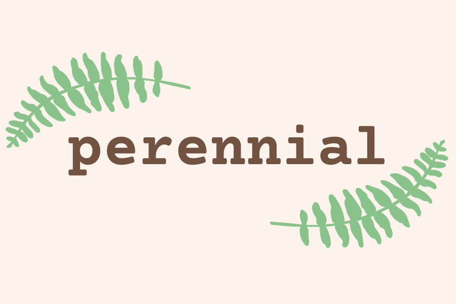
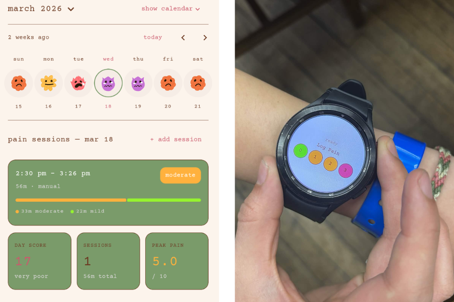

# 🌿 *perennial:* bloom through the seasons

This Android app and accompanying WearOS app utilizes smartwatch sensor data and manual logging to help users quietly and mindfully track chronic pain conditions like endometriosis.

## 💐 the problem

_perennial_ was born from the quiet crisis of endometriosis, a menstrual condition that notoriously 
takes a decade and invasive surgery to definitively diagnose. To endure this diagnostic 
purgatory and build a case to access life-changing treatment, patients are forced to meticulously 
track their symptoms while facing systematic sexism and bias. However, managing chronic pain is 
already exhausting, and traditional health trackers only add to the burden. Most apps on the market 
are sterile and hyper-clinical, focusing so heavily on the negative aspects of illness making users 
feel like faceless stats rather than people.

While endometriosis was our starting issue, we quickly realized this struggle is more widespread, inspiring
us to build an accessible tool for anyone managing chronic, cyclical pain. People navigating these 
conditions don't need more hospital charts, they need a private and calming 
sanctuary that validates their experience. _perennial_ is designed to remind users of their 
deep-rooted resilience, reframing flare-ups as seasons of dormancy to 
weather through before the next bloom.

## 🌷 our features
- **wearos integration:** Seamlessly pulls in continuous health data from your smartwatch to automatically detect and log potential pain sessions, reducing the cognitive load on high-pain days.
- **the bloom scale:** We replaced standard, clinical "pain faces" with our custom botanical bloom icons. A severe pain day is visualized as a crying lotus flower. A low pain day is a smiling succulent.
- **mindful logging:** Easily log or edit manual pain sessions and menstrual cycles. Track start and end times, peak pain levels (1-10), specific symptoms (cramping, fatigue, nausea), private journal notes, and menstrual flow.
- **perennial insights:** Your data is synthesized into a holistic "day score." Track your body's unique rhythms through a swipeable weekly strip and an interactive monthly calendar to find patterns in your seasons.
- **personal adjustments:** Our research-backed machine learning algorithm built to quantify your pain gradually personalizes itself to you through clever additions of decision trees to our model. 
- **calming ui/ux:** Designed with a deeply organic, earthy color palette (sage greens, warm browns, and creams) and minimalist typewriter typography to reduce sensory overload and anxiety.
- **secure & private:** Built with Firebase Authentication (supporting Email, Google, and Anonymous sign-ins) to ensure your deeply personal health data remains entirely yours.

## 🌹 tech stack
- **frontend:** Kotlin / Android Studio
- **wearables:** Kotlin -- WearOS & Samsung Health SDK
- **machine learning:** XGBoost,  NumPy, Pandas, matplotlib, PyTorch, Jupyter, Scikit-learn, Firebase Functions
- **backend & auth:** Firebase -- Authentication & Storage

## 🌸 our data

We established a custom pain baseline for each user, ranging from 0 (no pain) to 3 (extreme pain, tolerable for a maximum of 30 seconds). Using a TENS machine to simulate cyclical pain, we ran four trials per participant by applying two electrode patches; once on the stomach and three times on the dominant calf. The model was then trained directly on this localized data.

## 🌵 inspired by

- Chu, Yaqi, Xingang Zhao, Jianda Han, and Yang Su. 2017. “Physiological Signal-Based Method for Measurement of Pain Intensity.” Frontiers in Neuroscience 11 (May). https://doi.org/10.3389/fnins.2017.00279.
- Pouromran, Fatemeh, Srinivasan Radhakrishnan, and Sagar Kamarthi. 2021. “Exploration of Physiological Sensors, Features, and Machine Learning Models for Pain Intensity Estimation.” Edited by Khanh N.Q. Le. PLOS ONE 16 (7): e0254108. https://doi.org/10.1371/journal.pone.0254108.

## 🌻 license
This project is licensed under the MIT License. See the [LICENSE](LICENSE) file for details.

## 🌾 contributors
Feel free to submit issues or pull requests! Contributions are welcome.

Created at YHacks 2026 by [Alicia Yoon](https://github.com/acrylicpaintt), [Ethan Zhang](https://github.com/thezz3), [Uijin Cho](https://github.com/uijincho), and [Zachary Yuan](https://github.com/ZacharyYW)
